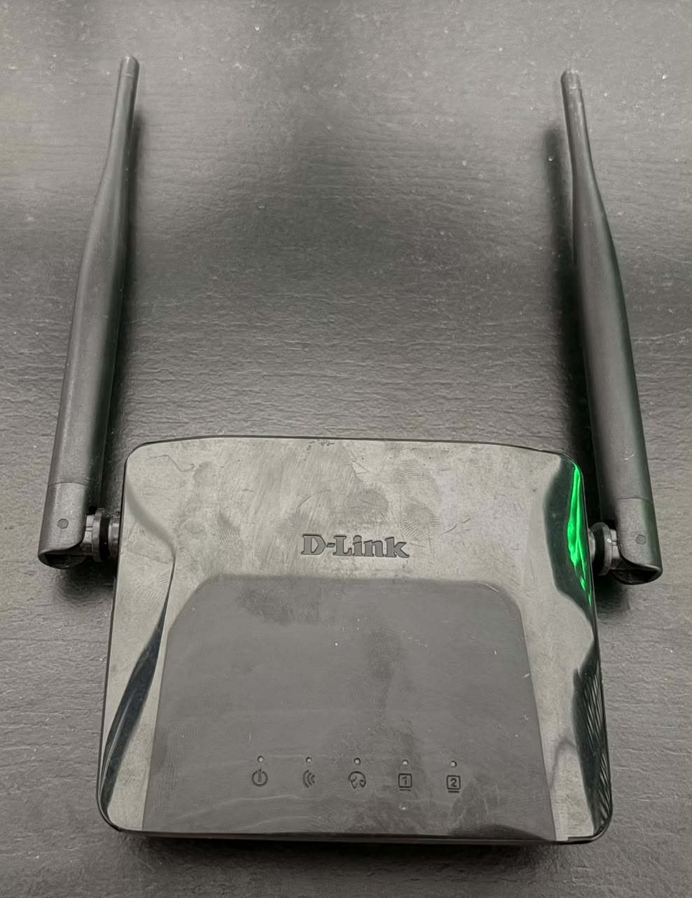
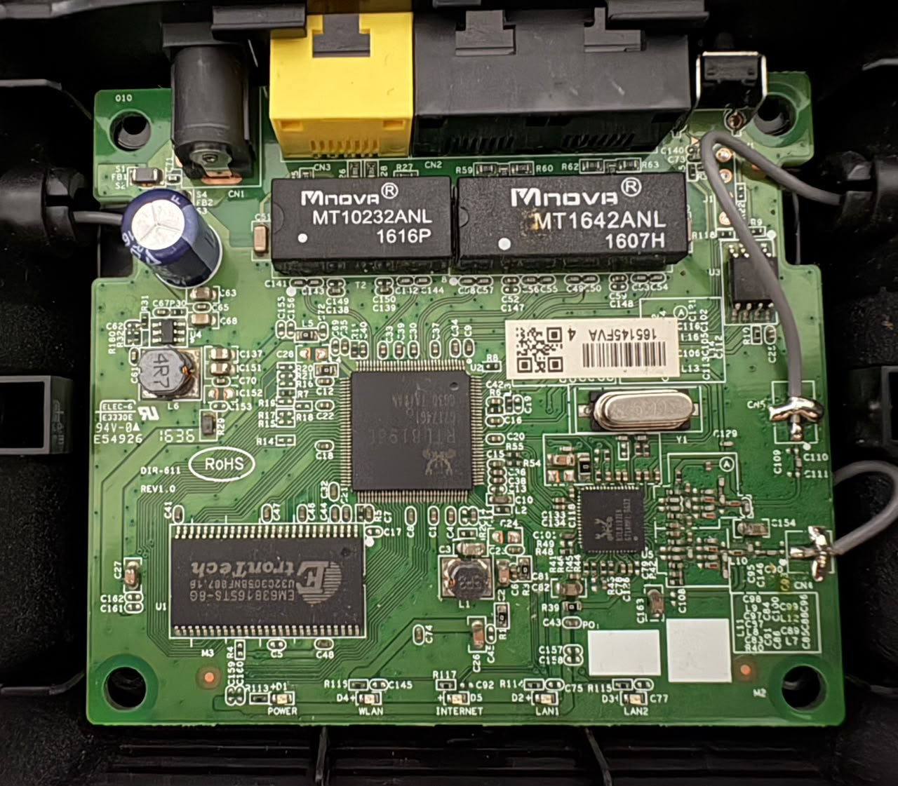

### Extração de Firmware de um Roteador Wi-fi
Aqui irei documentar sobre o estudo de extração de firmware de um roteador Wi-Fi e, possivelmente, sua engenharia reversa.

### Sobre o projeto 
Esse repositório tem como objetivo documentar minha jornada de aprendizado em extração e analise de firmware e engenharia reversa, o alvo que será usado aqui é um roteador Wi-Fi [D-LINK DIR-611].
O objetivo é puramente educacional: entender como um dispositivo físico funciona por dentro desde de seus componentes, extração física da memória, até a análise do sistema de arquivos e binários.

Estou começando sem experiência prévia na área, tenho conhecimento em apenas análise de circuitos que poderá nos ajudar na identificação dos componentes da placa.
Então esse README também serve como um diário de aprendizado para mim e possivelmente para quem está querendo iniciar nessa área.

### Objetivos

- Estudar o processo de extração do firmware do roteador.
- Identificar os métodos e interfaces que podem ser utilizados para obter o firmware.
- Analisar o firmware extraído.
- Documentar as descobertas realizadas durante o processo.
- Investigar a possibilidade de realizar engenharia reversa do dispositivo.

### Roteador fechado

O roteador utilizado neste estudo é um D-Link DIR-611.

### Placa aberta

Essa é a placa do roteador em si, ainda sem a identificação dos componentes.
